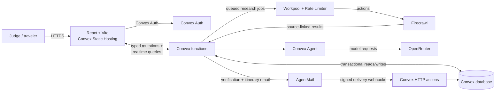

# Trip-Weaver

Trip planning is fragmented across search, spreadsheets, booking tabs, and notes; Trip-Weaver turns live travel research, accessibility needs, costs, and saved choices into one private, reactive itinerary with a trip-aware AI assistant.

Built for the Convex All-Gas Hackathon.

## Live demo and judge access

**Live app:** [rare-scorpion-458.convex.site](https://rare-scorpion-458.convex.site)

No invitation or shared credentials are required. Create an account with an email
address and a 12–128 character password, then enter the six-digit verification
code delivered by AgentMail. After signing in, create a trip from the home page
or **Trips** and explore its planning, research, budget, assistant, and itinerary
workflows.

Firecrawl-backed searches consume a shared hackathon allowance. Reuse displayed
results when possible and refresh only when needed.

## 60–90 second walkthrough

> **Submission media placeholder:** Add the hosted walkthrough link or replace
> this note with an embedded `docs/trip-weaver-demo.gif` before judging.

Suggested flow: create a trip, run one research search, save a result, review the
reactive budget and itinerary, ask the trip-aware assistant a question, and email
the itinerary.

## Screenshots

> **Submission media placeholder:** Add screenshots of the trip planner,
> Firecrawl research results, budget dashboard, and final itinerary before judging.

## Feature highlights

- **One workspace for the whole trip:** plan multi-city routes, flights, lodging,
  local transportation, interests, accessibility requirements, and profile defaults.
- **Source-linked live research:** Firecrawl finds flight options, stays, activities,
  events, transportation fares, and extra fees without presenting missing data as fact.
- **Accessibility-aware discovery:** requirements travel with the trip, and activity
  results separate confirmed matches, unknowns, and source-supported mismatches.
- **Reactive trip budgets:** selected transportation and researched fees roll into
  category totals, daily spending graphs, and cached ECB reference-rate conversions.
- **A versatile planning assistant:** the Convex Agent component gives the assistant
  the owned trip's current route, selections, bookings, saved ideas, and itinerary.
- **A usable product:** combine booked transportation and planned activities into a
  chronological itinerary, then send an immutable snapshot through AgentMail.
- **Private by default:** Convex Auth, server-derived ownership, validation, rate
  limits, stale-edit protection, and cleanup keep each traveler's data isolated.

## Architecture



The browser receives live updates from Convex as research jobs, assistant requests,
and email delivery events progress. Secrets and third-party calls remain in Convex
actions; the Vite client receives only validated, owner-scoped data.

## Built with Convex

Convex is Trip-Weaver's backend, realtime synchronization layer, job orchestrator,
authentication system, AI-agent runtime, HTTP endpoint host, and frontend host.

- **Database and functions:** a type-safe schema, indexed private trip data,
  transactional mutations, paginated queries, actions, and scheduled functions.
- **Realtime UI:** planner, research, budget, assistant, and email states update from
  reactive queries without a separate websocket or cache layer.
- **Convex Auth:** email/password accounts with AgentMail verification and ownership
  derived server-side from the authenticated user's stable ID.
- **Convex components:** Agent powers persistent trip-aware conversations, Workpool
  runs bounded research jobs, Rate Limiter protects costly operations, and Static
  Hosting serves the production Vite build.
- **Durable integrations:** Convex actions call Firecrawl and OpenRouter, while HTTP
  actions verify AgentMail webhooks and reconcile delivery events.
- **Production deployment:** one workflow tests and type-checks the app before
  deploying the Convex backend and static frontend together.

## Local development setup

Each developer runs an independent local Convex backend and database. Backend
code is shared through Git, but local data and environment configuration are not.

### Prerequisites

Before configuring the project, a Trip Weaver team administrator must:

1. Open the [Convex dashboard](https://dashboard.convex.dev/).
2. Select **Trip Weaver team**.
3. Open **Team Settings**, then **Members**.
4. Invite the developer to the team.

The developer must also have a supported Node.js and npm installation.

### Install and configure

Clone the repository, install its locked dependencies, and configure Convex:

```sh
git clone git@github.com:melaniekukura/trip-weaver.git
cd trip-weaver
npm ci
npm run dev:backend -- --configure existing
```

Log in to Convex if prompted, then select:

1. **Trip Weaver team**.
2. The existing **trip-weaver** project.
3. **local deployment (BETA)**.

The Convex CLI generates the client bindings under `convex/_generated/` and
creates `.env.local` with values similar to:

```env
CONVEX_DEPLOYMENT=local:local-trip_weaver-trip_weaver
CONVEX_URL=http://127.0.0.1:3210
CONVEX_SITE_URL=http://127.0.0.1:3211
```

Ports may differ when another local service is already using them. Manually add
`VITE_CONVEX_URL` using the exact value generated for `CONVEX_URL`:

```env
VITE_CONVEX_URL=http://127.0.0.1:3210
```

Do not use environment-variable interpolation here; copy the complete URL.

### Run the application

Keep the backend running in the first terminal:

```sh
npm run dev:backend
```

Start the Vite frontend in a second terminal:

```sh
npm run dev
```

Open the URL printed by Vite, normally `http://localhost:5173`.

The local backend stops when `npm run dev:backend` exits. Do not commit or share
`.env.local` or the `.convex/` local database directory. Each developer receives
an independent local database.

## Production hosting

The production frontend is served through Convex Static Hosting at
[rare-scorpion-458.convex.site](https://rare-scorpion-458.convex.site). Convex
hosts both the static Vite build and backend, so no local terminal needs to stay
open.

The **Deploy production** GitHub Actions workflow runs tests and TypeScript lint
before deploying pushes to `main`. It uses the repository's
`CONVEX_DEPLOY_KEY` secret to run `npm run deploy`, which updates the Convex
backend and static frontend together. The workflow can also be run manually from
GitHub Actions, but only from `main`.

## Convex backend

The backend stores Convex Auth accounts and private saved trips. It also exposes
`api.health.check` to verify the connection and `api.flights.search` for mock
flight searches.

### Authentication and saved trips

Create an account with an email address and a password of 12–128 characters.
After signing in, **My trips** supports creating, editing, and deleting plans.
Trips include destinations, calendar dates, budget, currency, traveler count,
and interests. Changes persist in the local Convex database.

The frontend signs users out after 30 minutes without typing, clicking, or
scrolling. A warning appears two minutes beforehand with a **Stay signed in**
button. Activity is shared across tabs and retained on reload; elapsed time is
checked again when a tab resumes. Unsaved form changes are lost on sign-out.
This is a browser inactivity timer, not a server-enforced idle-session limit.

The `trips:list`, `trips:get`, `trips:create`, `trips:update`, and `trips:remove`
functions require authentication. Ownership is derived from Convex Auth's stable
user ID. Lists use an owner index and pagination; updates reject stale forms.

Each developer's local deployment needs its own `JWT_PRIVATE_KEY` and `JWKS`
signing keys. Follow the [manual Convex Auth key setup](https://labs.convex.dev/auth/setup/manual)
to generate these and set them in the **local deployment's** environment settings.
Do not put signing keys in Vite variables or commit them. `SITE_URL` can be set to
the frontend origin, normally `http://localhost:5173`.

New accounts receive a six-digit AgentMail verification code during sign-in. The
code expires after 15 minutes. Existing unverified accounts must sign out and
sign back in to complete verification. Password reset is not implemented yet.

### AgentMail email delivery

Verified users can send a saved itinerary snapshot to their account address from
the final **Itinerary** tab. The UI shows queued, sending, sent, delivered,
bounced, rejected, and retry states using signed AgentMail webhook events.

Configure each Convex deployment with these backend environment variables:

- `AGENTMAIL_API_KEY`
- `AGENTMAIL_INBOX_ID`
- `AGENTMAIL_WEBHOOK_SECRET`

Set secrets interactively with `npx convex env set <NAME> --deployment <TARGET>`.
In AgentMail, send `message.sent`, `message.delivered`, `message.bounced`, and
`message.rejected` events to `<CONVEX_SITE_URL>/webhooks/agentmail`. Never put
these values in Vite variables or commit them.

### Legacy mock flight action

The UI no longer uses this action. For the real prototype, see below.
Call `api.flights.search` with a source and destination:

```ts
const result = await convex.action(api.flights.search, {
  source: "Detroit, MI",
  destination: "Los Angeles, CA",
});
```

The action currently returns clearly labeled mock flight data. Its network-capable
action boundary is separate from the Firecrawl research integration below.

### Firecrawl web research

Saved trips include a **Find flights** prototype: one-way or round-trip economy for one adult
in USD, using Firecrawl to read Google Flights. Enter airport codes and a departure
date to see up to five observed fares, source links, progress/errors, and refresh.
Matching results are cached for 15 minutes, with ownership checks and request limits.
See [the research API and itinerary handoff](references/flight-search.md).

`convex/firecrawl.ts` uses Firecrawl's v2 REST API directly from Convex; no browser
SDK or additional service is required. It provides two internal actions:

- `firecrawl:search`: search any travel topic; returns source URLs, titles,
  descriptions, retrieval time, and optional Markdown.
- `firecrawl:scrape`: read one HTTP(S) page as Markdown with its source URL.

These low-level actions remain internal. The authenticated, rate-limited
`flightJobs:start` mutation queues flight searches, and `flightJobs:latest` reads results.
They can be invoked by backend actions, the Convex dashboard, or the authenticated
Convex CLI. The old mock flight form is removed from the UI. The prototype does
not verify checkout availability or support multiple travelers. Round-trip results
let you choose an outgoing flight, retrieve matching returns, and filter each leg
separately. Return-option prices cover both flights. Confirm availability and
booking details in Google Flights; return selection uses Firecrawl browser credits.

#### Configure and verify

1. Create a key in the [Firecrawl dashboard](https://www.firecrawl.dev/app).
2. Start the existing local backend in a terminal:

   ```sh
   npm run dev:backend
   ```

3. In another terminal, set the backend secret interactively so it stays out of
   shell history:

   ```sh
   npx convex env set FIRECRAWL_API_KEY --deployment local
   ```

   `.env.local` configures the CLI and Vite; putting a secret there alone does
   **not** configure the Convex runtime. Never use `VITE_FIRECRAWL_API_KEY`.
   Each cloud development or production deployment needs its own secret setting.

   Trip-Weaver reserves credits atomically before each Firecrawl request: 1 for
   a basic scrape, 2 for search, 5 for structured extraction, 7 for search with
   scraped content, and 10 for a browser interaction. Reported usage replaces
   each reservation when the request completes, and failed requests release it.
   Reservations from interrupted requests expire after three minutes.
   Each browser session is capped at 500 credits and the project at 24,000.
   Cached results do not spend credits. The signed-in header shows reported
   session and project use while testing.

4. Run a minimal live search (uses Firecrawl credits):

   ```sh
   npx convex run firecrawl:search '{"query":"Kyoto official tourism","limit":1}'
   ```

5. To read one returned source, pass its URL:

   ```sh
   npx convex run firecrawl:scrape '{"url":"https://www.japan.travel/en/"}'
   ```

Once Convex regenerates its bindings, a backend action can call:

```ts
import { internal } from "./_generated/api";

const research = await ctx.runAction(internal.firecrawl.search, {
  query: "Kyoto events October 2026 official tourism",
  limit: 3,
  includeContent: true,
});
```

Search defaults to five results and snippets only. `includeContent: true` also
scrapes those results and uses additional credits. Results contain at most 30,000
Markdown characters per page and mark shortened content with `truncated: true`.
Requests time out after 45 seconds and are not retried automatically.

Missing keys, invalid keys, insufficient credits, rate limits, failed pages, and
network failures produce explicit errors; the integration never substitutes mock
results. Web content is untrusted source material for the agent, not instructions.
Search results are research leads, not verified live fares or booking inventory;
the existing mock flight API remains explicitly labeled as mock.

Run `npm test` for mocked integration tests (no credits used), `npm run lint` for
frontend and backend type checks, and `npm run build` for the frontend build.

API references: [Search](https://docs.firecrawl.dev/api-reference/endpoint/search)
and [Scrape](https://docs.firecrawl.dev/api-reference/endpoint/scrape).
